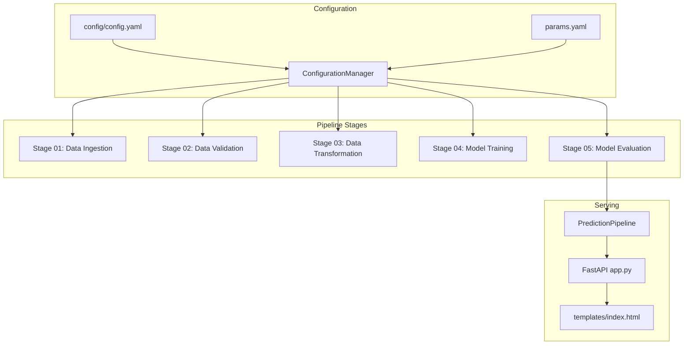

# NLP Text Summarization App

An end-to-end dialogue summarization system built with **FastAPI**, **Hugging Face Transformers**, **PyTorch**, and a modular ML pipeline architecture. The project demonstrates how raw dialogue data can be ingested, validated, transformed, fine-tuned, evaluated, and served through both REST APIs and a custom web interface.

This repository is intentionally designed as a practical AI/ML engineering showcase: it emphasizes clean pipeline boundaries, configuration-driven execution, reproducible artifacts, model serving, and a lightweight UI suitable for project demonstrations.

## Project Highlights

- **End-to-end NLP lifecycle**: ingestion, validation, tokenization, model training, evaluation, and inference.
- **Transformer-based summarization** using Hugging Face `AutoModelForSeq2SeqLM` and `AutoTokenizer`.
- **FastAPI serving layer** with `/train` and `/predict` endpoints.
- **Custom web interface** for recruiter/client demos without relying only on Swagger UI.
- **Config-driven architecture** using `config/config.yaml` and `params.yaml`.
- **Modular source layout** separating components, pipeline stages, configuration, entities, utilities, and API serving.
- **CPU-friendly training mode** suitable for constrained local machines such as a MacBook Air.
- **Experiment notebooks** retained under `research/` to show iterative development and stage-wise exploration.

## Use Case

The application summarizes multi-turn conversations into concise natural-language summaries. This is useful for:

- customer support chat summarization
- meeting note generation
- CRM conversation compression
- call center transcript summarization
- messaging and collaboration tools
- internal knowledge management

Example input:

```text
Amit: Hey Priya, are we still meeting for the project discussion today?
Priya: Yes, but I might be 10 minutes late. My previous class is running over.
Amit: No problem. I booked the library discussion room from 4 PM to 5 PM.
Priya: Great. I finished the introduction and methodology sections.
Amit: Nice. I will bring the dataset analysis and charts.
Priya: Perfect. After that, we can divide the presentation slides.
```

Example output:

```text
I booked the library discussion room from 4 to 5 PM. I finished the introduction and methodology sections.
```

The sample output above reflects a lightweight local training configuration. The architecture supports training on larger subsets or the full dataset when stronger compute is available.

## System Architecture

```mermaid
flowchart LR
    A[Raw Dialogue Dataset] --> B[Data Ingestion]
    B --> C[Data Validation]
    C --> D[Data Transformation]
    D --> E[Model Training]
    E --> F[Model Evaluation]
    F --> G[Saved Model Artifacts]
    G --> H[Prediction Pipeline]
    H --> I[FastAPI REST API]
    I --> J[Custom Web UI]
```



## Pipeline Design



## Repository Structure

```text
.
├── app.py
├── main.py
├── requirements.txt
├── setup.py
├── config/
│   └── config.yaml
├── params.yaml
├── templates/
│   └── index.html
├── src/
│   └── textSummarizer/
│       ├── components/
│       │   ├── data_ingestion.py
│       │   ├── data_validation.py
│       │   ├── data_transformation.py
│       │   ├── model_trainer.py
│       │   └── model_evaluation.py
│       ├── config/
│       │   └── configuration.py
│       ├── constants/
│       │   └── __init__.py
│       ├── entity/
│       │   └── __init__.py
│       ├── logging/
│       │   └── __init__.py
│       ├── pipeline/
│       │   ├── stage_01_data_ingestion.py
│       │   ├── stage_02_data_validation.py
│       │   ├── stage_03_data_transformation.py
│       │   ├── stage_04_model_trainer.py
│       │   ├── stage_05_model_evaluation.py
│       │   └── prediction.py
│       └── utils/
│           └── common.py
├── research/
│   ├── 01_data_ingestion.ipynb
│   ├── 02_data_validation.ipynb
│   ├── 03_data_transformation.ipynb
│   ├── 04_model_trainer.ipynb
│   └── 05_model_evaluation.ipynb
└── artifacts/
    └── generated locally, ignored by git
```

## Core Components

### 1. Data Ingestion

File: `src/textSummarizer/components/data_ingestion.py`

Responsibilities:

- downloads the SAMSum dialogue summarization dataset
- stores the raw zip file under `artifacts/data_ingestion`
- extracts dataset files into the local artifact directory
- avoids repeated downloads when the file already exists

### 2. Data Validation

File: `src/textSummarizer/components/data_validation.py`

Responsibilities:

- verifies that the expected dataset splits are available
- checks for `train`, `test`, and `validation`
- writes validation status to `artifacts/data_validation/status.txt`

### 3. Data Transformation

File: `src/textSummarizer/components/data_transformation.py`

Responsibilities:

- loads the dataset from disk
- tokenizes dialogue text as model input
- tokenizes summaries as target labels
- applies truncation for long conversations
- saves the transformed dataset for training

Key transformation logic:

```python
input_encodings = tokenizer(
    example_batch["dialogue"],
    max_length=1024,
    truncation=True
)

target_encodings = tokenizer(
    text_target=example_batch["summary"],
    max_length=128,
    truncation=True
)
```

### 4. Model Training

File: `src/textSummarizer/components/model_trainer.py`

Responsibilities:

- loads a sequence-to-sequence transformer checkpoint
- prepares a `DataCollatorForSeq2Seq`
- configures Hugging Face `Trainer`
- trains the model on tokenized dialogue-summary pairs
- saves the model and tokenizer under `artifacts/model_trainer`

This project currently uses a deliberately small training subset so it can run on local CPU-constrained hardware.

### 5. Model Evaluation

File: `src/textSummarizer/components/model_evaluation.py`

Responsibilities:

- loads the trained model and tokenizer
- generates summaries on test samples
- computes ROUGE scores
- saves evaluation metrics to `artifacts/model_evaluation/metrics.csv`

### 6. Prediction Pipeline

File: `src/textSummarizer/pipeline/prediction.py`

Responsibilities:

- loads the saved tokenizer
- loads the trained summarization model
- builds a Hugging Face text generation pipeline
- returns a summary for user-provided dialogue text

## API Endpoints

The application exposes both a custom web page and REST endpoints.

| Method | Endpoint | Purpose |
| --- | --- | --- |
| `GET` | `/` | Custom demo web interface |
| `GET` | `/docs` | Swagger UI generated by FastAPI |
| `GET` | `/train` | Runs the complete training pipeline |
| `POST` | `/predict?text=...` | Generates a summary for dialogue text |

## Web Interface

The custom UI is available at:

```text
http://127.0.0.1:8085/
```

It includes:

- dialogue input text area
- sample dialogue loader
- summarization button
- training button
- model output panel
- runtime/status display
- link to Swagger API docs

## Setup Instructions

### 1. Clone The Repository

```bash
git clone <your-repository-url>
cd nlp_text_summarization_app
```

### 2. Create A Python Environment

Use Python 3.11 or Python 3.12. Python 3.13 is not recommended for this project because some ML dependencies may not provide compatible wheels.

```bash
python3.11 -m venv .venv
source .venv/bin/activate
```

If `python3.11` is not available on macOS:

```bash
brew install python@3.11
/opt/homebrew/bin/python3.11 -m venv .venv
source .venv/bin/activate
```

### 3. Install Dependencies

```bash
pip install --upgrade pip setuptools wheel
pip install -r requirements.txt
```

### 4. Run The Full ML Pipeline

You can run the complete training pipeline directly:

```bash
python main.py
```

This executes:

```text
Data Ingestion -> Data Validation -> Data Transformation -> Model Training -> Model Evaluation
```

### 5. Start The FastAPI Application

```bash
uvicorn app:app --host 0.0.0.0 --port 8085
```

Open the custom app:

```text
http://127.0.0.1:8085/
```

Open Swagger UI:

```text
http://127.0.0.1:8085/docs
```

## Running Through API

### Train Endpoint

```bash
curl http://127.0.0.1:8085/train
```

Expected response:

```text
Training successful !!
```

### Predict Endpoint

```bash
curl -X POST "http://127.0.0.1:8085/predict?text=Amit:%20Hey%20Priya,%20are%20we%20still%20meeting%20today?%20Priya:%20Yes,%20I%20will%20be%2010%20minutes%20late.%20Amit:%20No%20problem,%20I%20booked%20the%20library%20room."
```

Expected response:

```text
"Amit booked the library room and Priya will be 10 minutes late."
```

The exact output depends on the trained model checkpoint and training subset.

## Configuration

### `config/config.yaml`

Controls artifact paths, data paths, model checkpoint, tokenizer path, and metric output path.

Important sections:

```yaml
data_transformation:
  tokenizer_name: t5-small

model_trainer:
  model_ckpt: t5-small

model_evaluation:
  model_path: artifacts/model_trainer/pegasus-samsum-model
  tokenizer_path: artifacts/model_trainer/tokenizer
```

### `params.yaml`

Stores training hyperparameters such as epochs, batch size, logging steps, warmup steps, and gradient accumulation.

The current code also contains local CPU-friendly overrides inside `model_trainer.py` to keep the project runnable on constrained machines.

## Local Resource Strategy

This project was tuned to run on a small MacBook Air. To make the pipeline practical on limited CPU, memory, and disk:

- training uses a tiny subset by default
- device is forced to CPU for stability
- model checkpoint is lightweight
- generated artifacts are excluded from git
- evaluation is run on a small test sample

This makes the project ideal for demonstrating architecture and ML workflow correctness. For production-grade model quality, train on a larger subset or full dataset using stronger compute.

To increase training data, update `src/textSummarizer/components/model_trainer.py`:

```python
train_data = dataset_samsum_pt["train"].select(range(100))
eval_data = dataset_samsum_pt["validation"].select(range(20))
```

For full training:

```python
train_data = dataset_samsum_pt["train"]
eval_data = dataset_samsum_pt["validation"]
```

## GitHub Publishing Notes

The `artifacts/` directory is generated locally and should not be committed. It may contain downloaded datasets, model checkpoints, tokenizers, and evaluation outputs.

Recommended files to keep out of git:

```text
artifacts/*
logs/*
__pycache__/
.venv/
.DS_Store
```

Before pushing, verify:

```bash
git status
```

## Engineering Decisions

- **FastAPI** was selected for low-overhead ML model serving and automatic API documentation.
- **Hugging Face Transformers** provides reliable sequence-to-sequence modeling primitives.
- **ConfigurationManager** centralizes YAML-based configuration and keeps pipeline stages decoupled.
- **Dataclass entities** define typed configuration contracts between components.
- **Artifacts directory** separates generated runtime outputs from source code.
- **Research notebooks** preserve exploratory development while production code lives under `src/`.

## Skills Demonstrated

- NLP preprocessing and tokenization
- sequence-to-sequence transformer fine-tuning
- Hugging Face `Trainer` workflow
- ROUGE-based summarization evaluation
- FastAPI backend development
- ML pipeline modularization
- configuration-driven engineering
- local resource optimization
- model artifact management
- custom UI integration with REST APIs

## Future Improvements

- add Dockerfile implementation for containerized deployment
- add unit tests for configuration and pipeline components
- add asynchronous background task handling for `/train`
- add model/version metadata to the UI
- expose evaluation metrics in the web interface
- add CI checks for linting and import validation
- support cloud artifact storage such as S3
- deploy API and UI to a public endpoint

## Status

The project currently runs end to end locally:

```text
Training endpoint: working
Prediction endpoint: working
Custom web UI: working
Swagger API docs: available
```

This repository demonstrates a complete, inspectable NLP application lifecycle from dataset ingestion to model serving.
